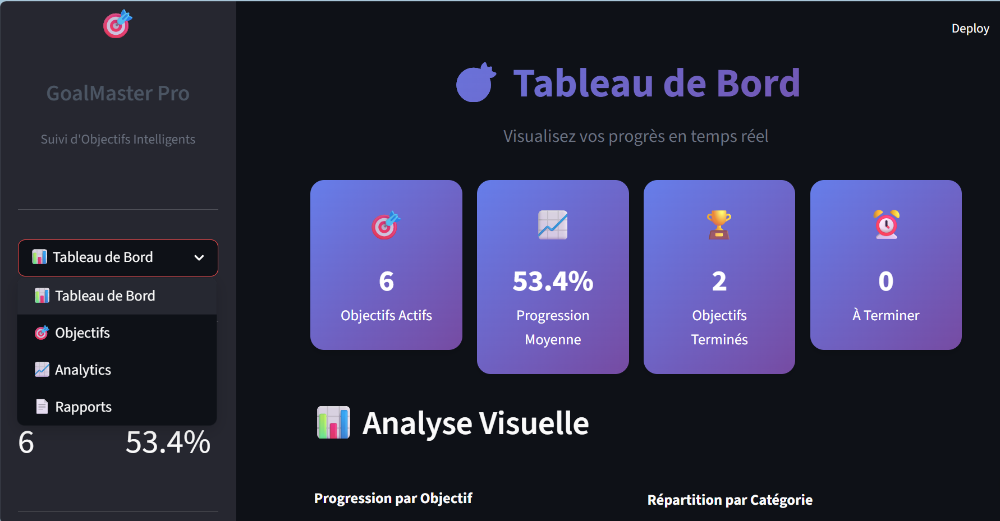
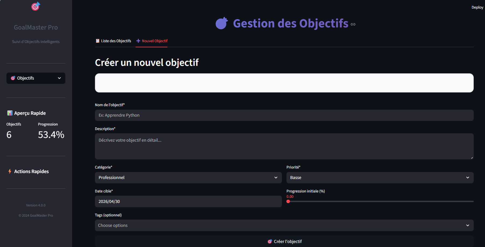
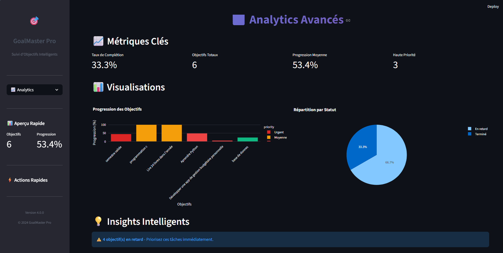
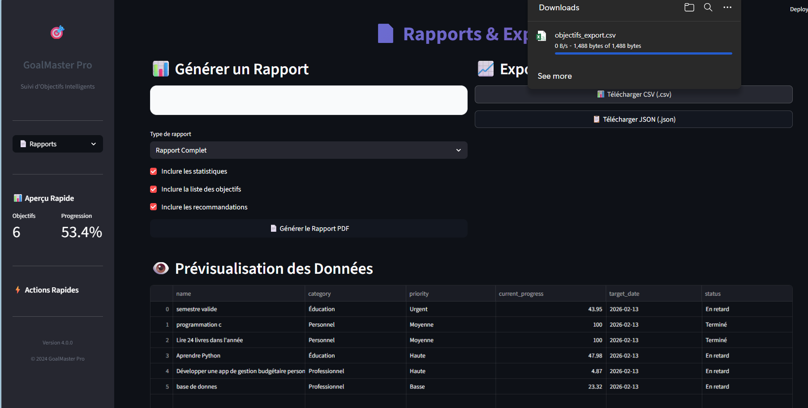

# Smart Goal Tracker

Smart Goal Tracker est une application Python interactive permettant de gérer et suivre les objectifs personnels avec visualisation statistique et génération de rapports PDF.

## Technologies utilisées

- Python
- Streamlit
- SQLite
- Pandas
- Plotly
- FPDF

## Fonctionnalités

- Ajouter des objectifs
- Suivre la progression
- Visualiser des statistiques
- Générer des rapports PDF

## Aperçu de l'application

### Dashboard

### Ajouter un objectif

### Statistiques

### Rapport PDF généré

## Installation

Installer les dépendances :

pip install -r requirements.txt

Lancer l'application :

streamlit run app.py

## Auteur

Amal EL ADDAOU  
Étudiante en Génie Logiciel et Systèmes Informatiques Distribués
